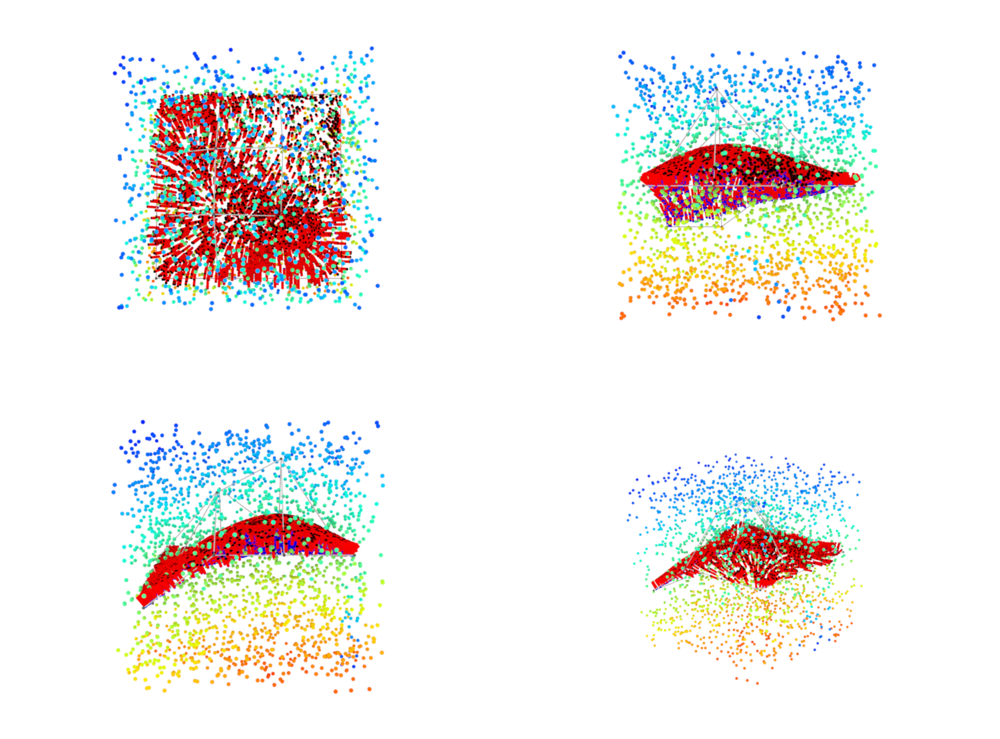

# Bezier surfaces

This repo is intended for my personal use to play with Bezier surfaces, calculating signed distance fields for these surfaces and visualizing them. Do not expect any meaningful documentation for that. Example of usages is located in `visualize_bezier.py` file. 

The class `BezierSurface` is adapted to perform calculating distance / normals / points on the surface at once for multiple defined surfaces. Hence, `control_points` passes as the argument is in the form: `[n, h, w, <xyz>]`, where:
- `n` - number of surfaces
- `h` - one of dimensions of an imaginary plain that contains points if they were projected onto its surface
- `w` - an orthogonal dimension to the `h`
- `<xyz>` - 3D coordinates of control points of the surface 

For the visualization, I used mitsuba docker that was ran in the background. For more information, please see [this](https://github.com/kacperkan/mitsuba-flask-service) repo.

## Example visualization

- This visualization contains 3 point view (up, left, front) + from the custom location of the camera.
- For each point on the surface, there's a separate normal vector calculated analytically for that point. 
- The color range [red, blue] corresponds to signed distance values [-inf, inf] (points "below" the surface have negative values)

## Additional info

`scene_create.py` contains an XML builder that builds a scene that is later parsed by the mitsuba engine through the API.

## Dependencies
All located in the `env.yml` for the Anaconda development.

